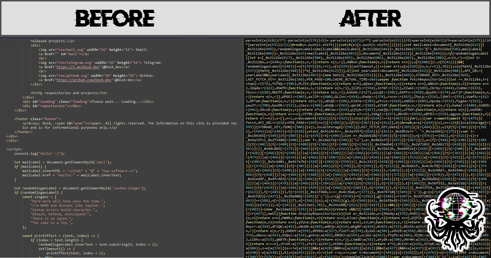

# WebSafeCompiler (WSC)
**WebSafeCompiler** (WSC) is an advanced utility designed for the optimization, minification, and obfuscation (if you need it) of web applications and websites using `Node.js`. It enhances your web assets by reducing file sizes or providing durable protection against reverse engineering, ensuring your code is deployment-ready and secure.

## 🚀 Little about
To leverage the full potential of **WebSafeCompiler**, execute the following command in your terminal:
```bash
node wsc.js <input_dir> <output_dir> [--drm] [--smart]
```

### Arguments & options:
* `<input_dir>`: Directory containing the source files to be processed.
* `<output_dir>`: Directory where the optimized and obfuscated files will be output.
* `-d, --drm`: Enables code obfuscation (DRM protection) to secure your source code against unauthorized analysis.
  * **🚫 disabled**: The utility focuses on optimizing your website’s files, ensuring they are lightweight and efficient.
  * **✅ enabled**: The utility emphasizes the protection of your intellectual property by applying rigorous obfuscation techniques to your code.
    * **HTML obfuscation**: HTML files are also obfuscated by adding non-functional random attributes and classes, making it difficult to reverse engineer while maintaining the visual and functional integrity of your web pages.
    * **JavaScript obfuscation**: Files using JavaScript will go through several stages of obfuscation, including adding unused code and encrypting strings.
* `-s, --smart`: Automatically detects minified files and skips them. This includes JS and CSS files.
* `-h, --help`: Displays the help message with detailed usage instructions.
* `-v, --version`: Outputs the current version of WebSafeCompiler.

### 👨🏼‍💻 Usage example:
```bash
node wsc.js "/path/to/source" "/path/to/output" --drm --smart
```

This command will process all files within the specified source directory, optimize them, and, if the obfuscation flag is enabled, protect the code from unauthorized access or tampering. The output files will be ready for deployment in your web environment.



## 📚 Libraries used
**WebSafeCompiler** uses the following libraries to work with JavaScript codes:
* **[uglify-js](https://www.npmjs.com/package/uglify-js)**: Provides sophisticated JavaScript preprocessing and minification, compressing your code without sacrificing functionality.
* **[javascript-obfuscator](https://www.npmjs.com/package/javascript-obfuscator)**: Applies advanced techniques to protect your JavaScript code by obfuscating it, making it significantly harder for attackers to reverse-engineer.

## 🛠️ How to install?
To get started with **WebSafeCompiler**, you'll need to have [Node.js](https://nodejs.org) installed on your system. Follow these steps to install the required packages:

1. **Install Node.js**: Download and install Node.js from [Node.js official website](https://nodejs.org). Follow the installation instructions for your operating system.

2. **Clone the repository**: If you haven't already, clone the repository to your local machine:
    ```bash
    git clone <repository-url>
    cd <repository-directory>/source
    ```

3. **Install dependencies**: Navigate to the project directory and install the necessary npm packages:
    ```bash
    npm install
    ```

4. **Done! You can use WSC.**

## 📜 License
This project is licensed under the MIT License. For more details, please refer to the [LICENSE](./LICENSE) file.
